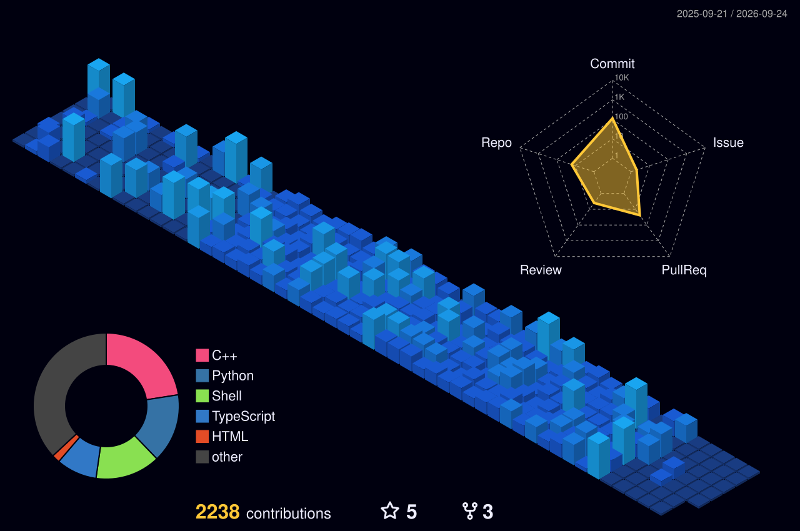

### Hi there, I'm Alex 👋

🪪 **About Me**

struct Facts {
string name, university, degree;
};

class Me {

public:

Facts Alex;

    Alex.name        = "Alexander Venizelos";
    Alex.university  = "NTUA";
    Alex.degree      = "MSc Electrical and Computer Engineering";
    
};

  
  

### Tech Stack

**Languages**
 

  

**Web & Backend**
 

  

**Tools & Platforms**
 

